# IIT Mandi DGX Cluster: Comprehensive B200 PyTorch Setup Guide

Welcome to the IIT Mandi DGX Cluster! This guide is designed for **all users** who need to configure a PyTorch deep learning environment for the NVIDIA B200 GPUs. 

Due to the bleeding-edge nature of the Blackwell architecture, standard PyTorch installations will fail. This document explains the underlying hardware, the software bottlenecks you will encounter, and provides a guaranteed, step-by-step solution to set up your environment.

## 1. Basics: Using the GPUs Properly
The DGX Cluster operates using a SLURM workload manager. You should **never** run intensive tasks on the login node. Always submit jobs via `sbatch`.

### Available GPU Resources (MIG - Multi-Instance GPUs)
The cluster utilizes Multi-Instance GPU (MIG) technology to partition massive GPUs into smaller, isolated instances. 
- **Small MIGs (`small-b200`)**: 45GB VRAM. Best for evaluation, inference, and testing.
- **Medium MIGs (`medium-b200`)**: 90GB VRAM. Best for standard model training.
- **Full GPUs (`full-b200`)**: 180GB VRAM. Reserved for massive LLMs or highly distributed training.

**Example SLURM Header for a Small MIG:**
```bash
#SBATCH --partition=small-b200
#SBATCH --gres=gpu:nvidia_b200_1g.45gb:1
```

---

## 2. The Core Hardware Problem: `sm_100` Architecture

The B200 GPUs are built on NVIDIA's **Blackwell** architecture, which corresponds to the CUDA compute capability **`sm_100`**. 

If you install PyTorch normally (`pip install torch`), you will encounter this fatal error:
> `RuntimeError: CUDA error: no kernel image is available for execution on the device`

**Why?** The standard stable releases of PyTorch (e.g., v2.4 or v2.6 with CUDA 12.4) only include compiled kernel instructions for architectures up to **Hopper (`sm_90`)**. Because standard PyTorch does not know how to talk to Blackwell hardware, the GPU cannot execute the neural network.

---

## 3. Workflow Diagram: The Setup Bottleneck vs. The Solution

```mermaid
graph TD
    %% Standard Approach Flow
    subgraph "The Failing Standard Approach"
        A[pip install torch] --> B[Downloads massive 2.5GB file]
        B -->|Network Timeout| C[IncompleteRead Error]
        C -.-> |Restarts at 0%| B
        
        A2[pip install -r requirements.txt] --> D[Dependency Resolver]
        D -->|Strict package bounds| E[Silently downgrades PyTorch]
        E --> F[CUDA 'no kernel image' Error at Runtime]
    end

    %% The Working Solution Flow
    subgraph "The Working B200 Solution"
        G[Step 1: wget -c] -->|Resumes on drop| H[Successfully download Nightly cu128 .whl files]
        H --> I[Step 2: pip install local_files.whl]
        I --> J[Step 3: --extra-index-url]
        J -->|Fetches Nightly Triton| K[Successful PyTorch 2.12 Installation]
        K --> L[Step 4: Remove strict PyTorch bounds in requirements.txt]
        L --> M[B200 Model Training Succesful!]
    end
```



---

## 4. The Complete Fix: Step-by-Step Instructions

To successfully configure your Conda or Virtual Environment for the B200 GPUs, follow these exact steps. This workflow guarantees that you bypass network drops, satisfy strict nightly dependencies, and compile against **CUDA 12.8**.

### Step 1: Manually Download the Nightly Wheels (Resumable)
Because the cluster's login node may drop the connection during large downloads (throwing an `IncompleteRead` error), we must use `wget -c`. If the download stops, **press the up arrow and run the command again**—it will resume exactly where it left off.

Run these sequentially in your environment directory:
```bash
# Download PyTorch 2.12.0 (Nightly, CUDA 12.8)
wget -c https://download-r2.pytorch.org/whl/nightly/cu128/torch-2.12.0.dev20260407%2Bcu128-cp310-cp310-manylinux_2_28_x86_64.whl

# Download matching TorchVision
wget -c https://download-r2.pytorch.org/whl/nightly/cu128/torchvision-0.27.0.dev20260407%2Bcu128-cp310-cp310-manylinux_2_28_x86_64.whl

# Download matching TorchAudio
wget -c https://download-r2.pytorch.org/whl/nightly/cu128/torchaudio-2.11.0.dev20260407%2Bcu128-cp310-cp310-manylinux_2_28_x86_64.whl

# Download the massive NVIDIA cuDNN dependency
wget -c https://files.pythonhosted.org/packages/3b/52/94aecda69df65ba1079a8b7dbe84632af5614dc0ed2c733185f6431874e3/nvidia_cudnn_cu12-9.20.0.48-py3-none-manylinux_2_27_x86_64.whl
```
*(Note: These links are for Python 3.10 on Linux. Adjust the `cp310` tags in the URL if using a different Python version).*

### Step 2: Install the NVIDIA cuDNN Dependency
```bash
pip install nvidia_cudnn_cu12-9.20.0.48-py3-none-manylinux_2_27_x86_64.whl
```

### Step 3: Install the PyTorch Ecosystem with Nightly Indexing
Now, install the three local wheels together. You **must** include the `--extra-index-url` flag. PyTorch Nightly requires a Nightly version of the `triton` compiler. This flag tells `pip` to fetch `triton` from PyTorch's custom servers instead of the standard PyPI index (where it doesn't exist).

```bash
pip install torch-2.12.0.dev20260407+cu128-cp310-cp310-manylinux_2_28_x86_64.whl torchvision-0.27.0.dev20260407+cu128-cp310-cp310-manylinux_2_28_x86_64.whl torchaudio-2.11.0.dev20260407+cu128-cp310-cp310-manylinux_2_28_x86_64.whl --extra-index-url https://download.pytorch.org/whl/nightly/cu128
```

### Step 4: Sanitize Your `requirements.txt`
If you install your project's other dependencies via a `requirements.txt` file, `pip` may notice that other packages (like `speechbrain` or `lightning`) prefer stable PyTorch versions. It will silently overwrite your Nightly installation. 

**Before running `pip install -r requirements.txt`:**
1. Open your `requirements.txt`.
2. Delete the lines containing `torch`, `torchvision`, and `torchaudio`.
3. Remove strict version pins (`==`) on any `nvidia-*` packages.
4. Run `pip install -r requirements.txt`.

Your environment is now completely configured to utilize the maximum power of the Blackwell `sm_100` GPUs!

---

## 5. Glossary of Jargon & Technical Processes

If you're new to managing cluster environments or advanced deep learning setups, here is a quick breakdown of the terminology and processes used in this guide:

### Hardware & Cluster Jargon
*   **SLURM (Simple Linux Utility for Resource Management)**: The cluster's job scheduler. It manages queues and allocates GPU/CPU resources to users so no one overloads the system. You request resources via `#SBATCH` tags.
*   **MIG (Multi-Instance GPU)**: A hardware feature that allows a massive physical GPU (like a 180GB B200) to be sliced into smaller, fully isolated instances (e.g., 45GB or 90GB chunks). This allows multiple users to share a single GPU card safely and efficiently.
*   **CUDA Compute Capability (e.g., `sm_90`, `sm_100`)**: An NVIDIA versioning system that dictates the hardware architecture of a GPU. `sm_90` is Hopper, `sm_100` is Blackwell. Software (like PyTorch) must be pre-compiled to support the specific compute capability of the GPU it runs on, otherwise it throws a "no kernel image" error.

### Python & Package Management Processes
*   **PyTorch Nightlies (Development Builds)**: These are bleeding-edge, daily builds of PyTorch containing the absolute newest code (often pushed just hours ago). They are required for brand-new hardware (like Blackwell) that standard, stable releases don't support yet.
*   **Wheel (`.whl`)**: A pre-compiled ZIP format for Python packages. Instead of your computer compiling massive C++/CUDA libraries from scratch (which takes hours), a wheel provides the ready-to-run binaries.
*   **Dependency Resolver / `ResolutionImpossible`**: When you run `pip install`, pip checks if all requested packages are compatible with each other. If Package A strictly requires PyTorch 2.4, but Package B strictly requires PyTorch 2.6, pip fails with `ResolutionImpossible` because it cannot mathematically satisfy both constraints.
*   `--extra-index-url`: By default, `pip` searches PyPI (Python Package Index) for libraries. This flag tells `pip` to *also* search an alternative server (like PyTorch's custom nightly server) to find specialized libraries like `triton`.

### Tools
*   **`wget -c`**: `wget` is a command-line utility used to download files from the internet. The `-c` (continue) flag is a lifesaver for massive downloads: if the connection drops midway, running the command again will resume the download from the exact byte it failed on, rather than starting over from 0%.
*   **Triton Compiler**: An open-source, Python-like language used to write highly efficient GPU code. PyTorch relies heavily on Triton to optimize its neural network layers under the hood. Nightly versions of PyTorch often require bleeding-edge Nightly versions of Triton.
